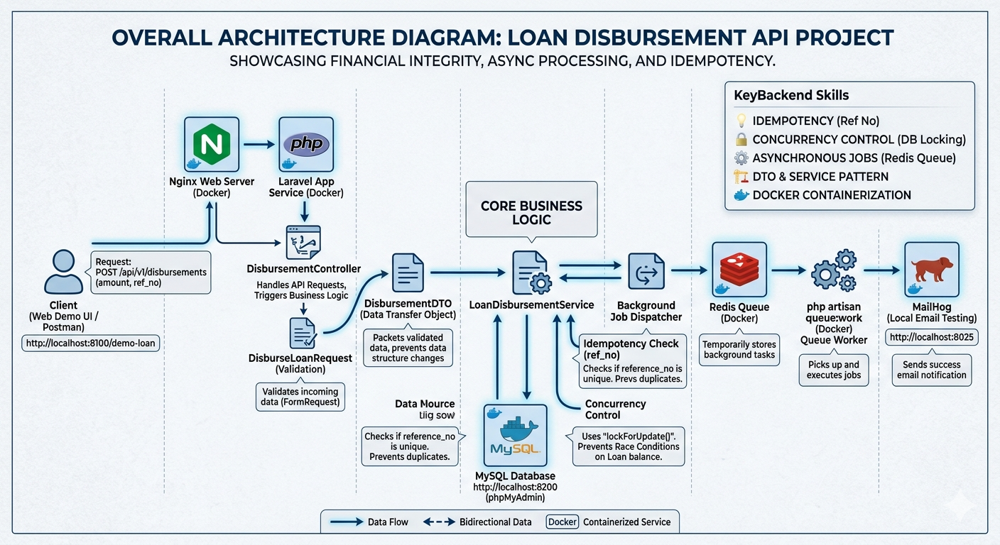

# Loan API

## 1. Overview

Loan API is a Laravel-based REST API for managing loan disbursements, fully containerized with Docker. The stack includes:

- **Laravel 13** (PHP 8.3) — Application framework
- **Nginx** — Web server
- **MySQL 8** — Relational database
- **Redis** — Caching & queue backend
- **MailHog** — Local mail testing
- **phpMyAdmin** — Database management UI

### Key Features

- **Idempotency** — Duplicate disbursements are prevented by checking `reference_no` before processing
- **Race Condition Protection** — `lockForUpdate()` and database transactions ensure consistency under concurrent requests
- **Atomic Balance Updates** — Loan balance deduction and transaction recording happen within a single DB transaction
- **Async Email Notifications** — Disbursement success emails are dispatched as queued jobs
- **UUID Primary Keys** — All models use auto-generated UUIDs

### Architecture Diagram



---

## 2. Objective

Provide a safe and reliable loan disbursement system that:

- Prevents duplicate disbursements via idempotency checks on `reference_no`
- Protects against race conditions when multiple requests hit the same loan simultaneously
- Ensures balance consistency through atomic database transactions
- Notifies users asynchronously via email without blocking the API response

---

## 3. How to Use

### Prerequisites

- [Docker](https://www.docker.com/)
- [Docker Compose](https://docs.docker.com/compose/)

### Setup

1. **Clone the repository**

   ```bash
   git clone <repository-url>
   cd loan-api
   ```

2. **Start all services**

   ```bash
   docker-compose up -d --build
   ```

3. **Configure environment**

   Copy the example env file inside `src/` and update database, Redis, and mail settings:

   ```bash
   docker exec -it loan_api_app cp .env.example .env
   docker exec -it loan_api_app php artisan key:generate
   ```

4. **Run migrations**

   ```bash
   docker exec -it loan_api_app php artisan migrate
   ```

5. **Start the queue worker**

   Open a new terminal and run:

   ```bash
   docker exec -it loan_api_app php artisan queue:work
   ```

### API Endpoint

**POST** `/api/v1/disbursements`

| Field          | Type    | Rules                           |
| -------------- | ------- | ------------------------------- |
| `loan_id`      | UUID    | Required, must exist in `loans` |
| `amount`       | Numeric | Required, min 1                 |
| `reference_no` | String  | Required, max 255               |

**Request Example:**

```json
{
  "loan_id": "9d2e1a3b-4c5f-6789-a0b1-c2d3e4f5a6b7",
  "amount": 5000.00,
  "reference_no": "TXN-20260512-001"
}
```

**Success Response (200):**

```json
{
  "status": "success",
  "message": "Disbursement processed successfully.",
  "data": {
    "transaction_id": "a1b2c3d4-e5f6-7890-abcd-ef1234567890",
    "reference_no": "TXN-20260512-001",
    "amount": 5000.00
  }
}
```

**Error Response (400):**

```json
{
  "status": "error",
  "message": "หมายเลขอ้างอิงนี้ (Ref No) ถูกใช้งานไปแล้ว"
}
```

### Web UI Demo

Test the end-to-end flow directly via the browser without using Postman:

- **URL:** [http://localhost:8100/demo-loan](http://localhost:8100/demo-loan)

### Service Ports

| Service     | Port | URL                   |
| ----------- | ---- | --------------------- |
| API (Nginx) | 8100 | http://localhost:8100 |
| MySQL       | 3310 | localhost:3310        |
| phpMyAdmin  | 8200 | http://localhost:8200 |
| MailHog UI  | 8025 | http://localhost:8025 |
| Redis       | 6379 | localhost:6379        |

### Stopping Services

```bash
docker-compose down
```

To remove all data (including the database volume):

```bash
docker-compose down -v
```
